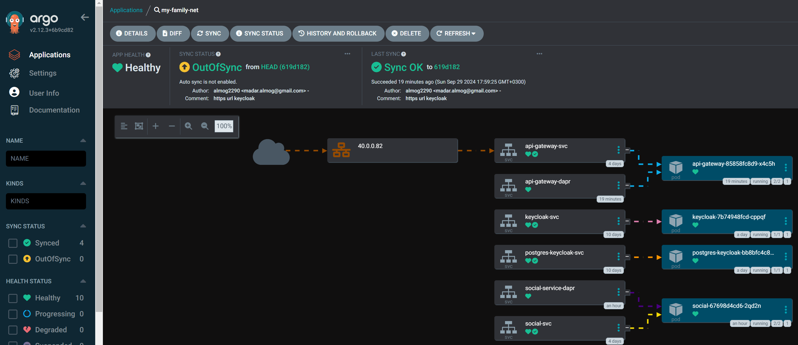
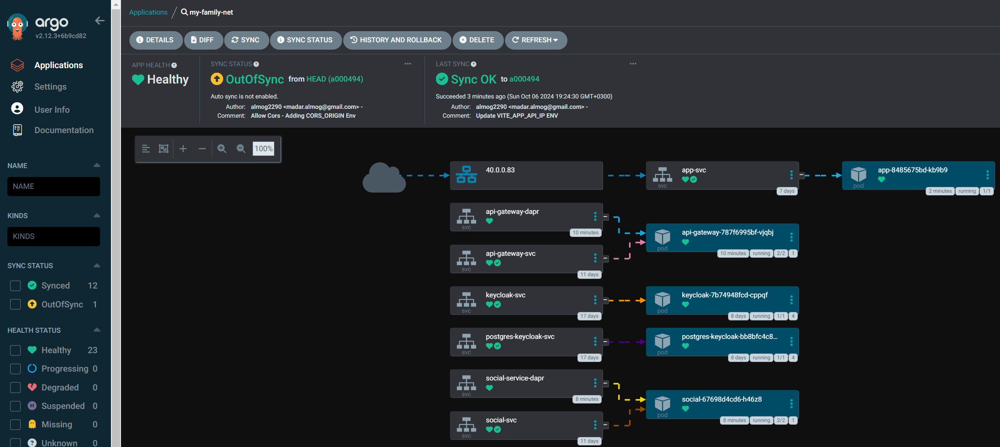
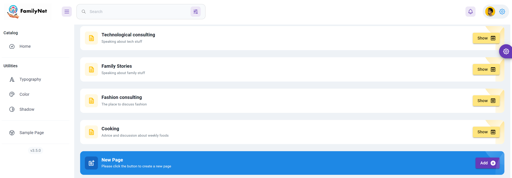

# MyFamliyNet-k8s
Services Involves right now : 
1) Keycloak (Ingress) 
2) API-Gateway (ClusterIP)
3) Social-Service (ClusterIP)
4) My-Family-App , React\Vite Framework (LoadBalancer)

### Expose API Gatway LoadBalancer (First Stage): 

### Expose My-Family-App (React App) , made API Gateway private - ClusterIP (Second Stage):

